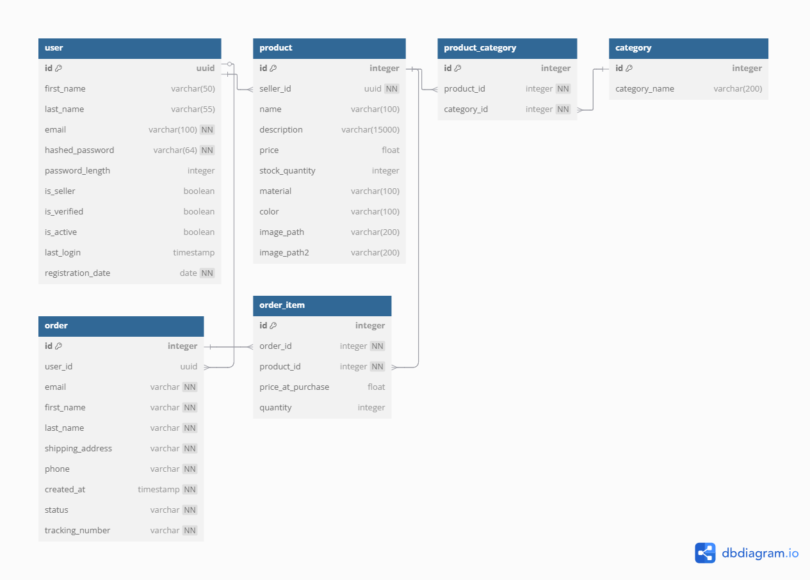

# E-Commerce Web Application

This project implements an e-commerce web application. Though initially designed for jewelry products, its modular and loosely coupled architecture makes it easily adaptable to any type of e-commerce business.

For demonstration and learning purposes, the project contains frontend implementations as well, but my main area of interest is backend development.\
The implementation is still in progress.

## Main tech stack
- FastAPI (Python 3.12)
- SQLAlchemy
- PostgreSQL
- Pytest
- Stripe API integration
- React (Javascript)
- HTML, CSS
- Docker
- Alembic
- Github Actions (CI)

## Achitecture
The main focus is on high performance, modularity, flexibility and security.
The app consists of a headless Content Management System (CMS) connecting to a Postgres database. The frontend apps are communicating with the backend through an API layer. The full decoupling of the backend and the frontend enables any kind of frontend to communicate with the backend which makes the frontend really easily customizable.

Unlike the monolith apps here the backend only handles the data and the logic, any kind of visualization is handled by the frontend only. 
To make the app more modular the Seller (Admin) and Customer frontends are separated. 

The backend is fully asynchronous to achieve high performance and efficient resource utilization:

- All routes are async, enabling concurrent handling of multiple API requests
- SQLAlchemy async session management for concurrent database operations
- Dependency injection for clean session management


### Database Schema



## Functionality

The Customer frontend is responsible for displaying available products, implementing the Cart functionality, and calling the API endpoint responsible for checkout. The Checkout is implemented using the [Stripe Test API](https://docs.stripe.com/test-mode). \
Filtering products by price, seller, and jewelry material is also implemented through corresponding backend endpoints. When a user completes payment successfully, the order is saved to the database with additional information (such as shipping address).

On the Seller frontend, sellers can upload, edit, and delete products. They can also add products to different categories or create new categories if needed. User profile editing and deletion are also handled through the seller frontend.\
Another feature of the Seller frontend is the Seller Statistics page, where sellers can view various statistics about their products by month (e.g., number of products sold by category, income, and best-selling products). This information is available by parsing the [custom metadata](https://github.com/sinkozs/GlimmerShop/blob/main/backend/services/checkout_service.py#L129) that is saved during checkout.


## Security

The authentication process is fully implemented, including user registration (sign up), login, password recovery, and email verification using a random code sent after registration. Emails are sent using an SMTP server.
- All sensitive information (passwords, keys) are stored locally in a .env file which is added to the `.gitignore` to prevent uploading it to Github unintentionally. These values as well as other (non confidential) configs are loaded by `parser.py`.

- The password is stored hashed in the database (using bcrypt). Verify passwords during login by comparing hashes.
  - TODO: While bcrypt is still considered safe, it is recommended to use Argon2 in new projects

- For production always use HTTPS (currently only HTTP is supported)

### JWT and http-only cookie
- Authentication is based on JWT. When a user logs in, the server creates a JWT containing the user's identity (ID and email).
- The signature is created using asymmetric signing algorithm (`RS256`). This uses a private (sign the token) and a public key (verification). 
  - The private key can be kept in secret on the server side, which is better for microservice architecture. Even if a service is compromised, the attacker only gets the public key, which can't create new tokens.
- The token is sent to the client as an HTTP-only cookie.
The client sends this token with each subsequent request.
  - Storing the JWT in an HTTP-only cookie prevents XSS attacks as the cookie's content isn't accessible from any malicious JS script inside the browser.
- Automatic user logout when the cookie expires (same time with the JWT). This ensures that the user must re-authenticate periodically and that inactive sessions don't remain open indefinitely.
- Because the application is in development mode and running on localhost it is currently using HTTP (and the cookie is configured that way). In production applications encrypted communication (HTTPS) is always a must. For production update these attributes of the response cookie: 
  -  `secure=True`: Ensures cookie is only sent over HTTPS
  - `samesite="strict"`: Prevents CSRF attacks by only sending cookie for same-site requests
```py
            response.set_cookie(
            key=http_only_auth_cookie,
            value=access_token,
            httponly=True,
            max_age=config.auth_config.token_expiry_minutes * 60,
            expires=config.auth_config.token_expiry_minutes * 60,
            samesite="strict",  
            secure=True,        # requires HTTPS
            domain=<your_domain>
        )
```

  - To always include the cookie in cross-origin requests set the `withCredentials: true` in the axios Client config on the fronted.  This is needed because the backend and the frontend applications are running on different ports now (which counts as different origins)
  ```js
  const apiClient = axios.create({
    baseURL: config.BACKEND_BASE_URL,
    headers: {
        'Content-Type': 'application/json'
    },
    withCredentials: true
});
  ```


### Considerations to prevent SQL injection
SQL injection is a type of security vulnerability where an attacker can insert (inject) malicious SQL code into a query, typically through user input fields. This can allow them to:

- Access data they shouldn't be able to see
- Modify or delete database records
- Potentially gain admin access

Raw SQL queries are vulnerable to injection, using parametrized queries can avoid it. This is easy using the SQLAlchemy's ORM:
```py
# Safe - uses parameterized queries
db.query(User).filter(User.email == email).first()

# UNSAFE - never do this
db.execute(f"SELECT * FROM users WHERE email = '{email}'")
```
Besides that use Pydantic models for input validation.

## Testing

Pytest is used for testing, as it provides great support for asynchronous applications. The controller pattern used in the server-side code allows each layer to be tested independently with easy dependency mocking. The service layer is tested with real database operations (using a separate test database), while controller tests use mocked services and router tests use mocked controllers.

Pytest supports testing asynchronous endpoints through the `@pytest_asyncio.fixture` decorator. This creates fixtures that can use the async/await syntax, enabling testing of async operations like database queries and FastAPI endpoints.\
Shared fixtures, including the test database session, test engine, and test client setup, along with mocked user service and controller, are stored in `tests/conftest.py`. This is a special pytest configuration file that is automatically discovered by pytest, making these fixtures available to all test files without explicit imports.
```py
    @pytest.mark.asyncio
    async def test_get_all_users_correct_data_types(self, test_users, test_session):

        """Test that returned user data contains all required fields and correct data types"""
        user_service = UserService(test_session)
        await add_test_users(test_session, test_users)

        users = await user_service.get_all_users()

        assert isinstance(users, list)
        assert isinstance(users[0], dict)
        [assert_user_field_types(u) for u in users]
```
Currently, comprehensive testing is implemented only for the User routes, covering all layers (service, controller, and router).

## CI
Two GitHub Actions workflows run on every commit:
1. Code Quality
   - Code formatting using Black
   - Linting with Flake8

2. Testing
   - Runs the test suite
## Deployment
The application is currently deployed locally using Docker Desktop and Docker Compose. \
TODO: Create separate containers for the frontend applications.

## Improvement ideas

**AWS Service Integration**

Several components could be migrated to AWS services:

  - Image handling: Store images in S3 buckets and use Lambda functions triggered by PutObject events to generate thumbnails automatically
  - Email services: Replace current SMTP server with Amazon SES for verification and password reset emails
  - Note: These AWS services would incur additional costs

**Authentication Enhancements**

  Add support for additional authentication providers:

  - Microsoft account
  - Facebook account
  - Other OAuth providers

**Testing Improvements**

- Implement end-to-end testing using Selenium IDE
- Expand test coverage to all routes and features
